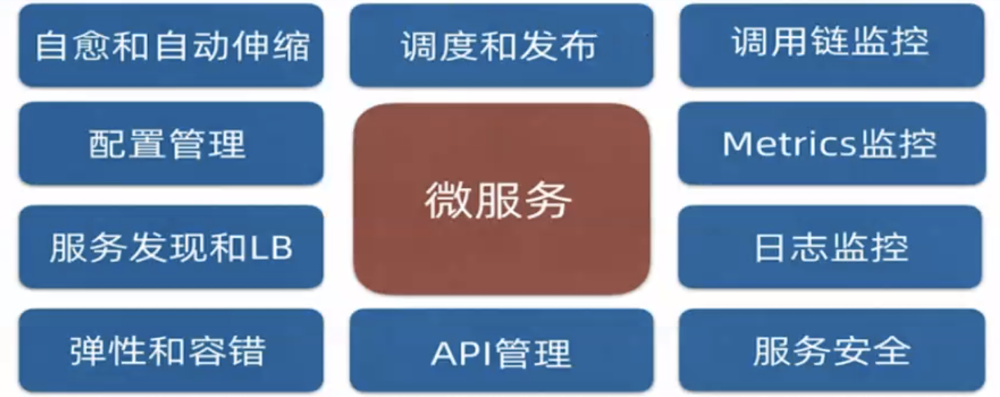

# Kubernetes基础知识

Kubernetes（发音 \[kubə'netis\]）简称K8s，它是一个能够跨主机进行容器编排的平台。它使用共享网络把多个主机构建成一个集群，一个或多个主机运行为主节点（`Master`），余下的所有主机运行为工作节点（`Worker Node`）。其中`Master`作为控制中心负责管理整个集群系统，`Node`接收请求并以`Pod`（容器集）形式运行工作负载。每个集群里最少需要有一个工作节点。

## Kubernetes的架构

Kubernetes的架构图如下：

### Master Node（主节点，控制平面） 

主节点负责Kubernetes集群的管理。这是所有管理任务的入口点。主节点负责编排工作节点，实际服务在其中运行。Master需要运行以下四个组件（应用程序）：

#### API server 

`API server` 是用于控制集群的所有`REST`命令的入口点。它处理REST请求，验证它们，并执行绑定的业务逻辑。从上面的架构图可以看到，它是整个集群数据的出入口。

#### controller-manager（控制器管理器） 

控制器使用`api serve`r监视集群的共享状态，并对当前状态进行更正性更改以将其更改为所需状态。控制器管理器是主节点内不同类型控制器的守护进程。

#### scheduler 

调度器，用来调度用户或者`pod`创建的对象的。调度程序拥有集群成员上可用资源的相关信息，以及配置的服务运行所需的资源，因此能够决定在何处部署特定服务。

#### etcd storage 

`etcd` 是一个简单、分布式、一致的`key-value`存储。用户通过`API server`存储到`etcd`。

### Worker node（工作节点，数据平面） 

#### kubelet 

`kubelet` 是`API server`的客户端，负责与主节点之间的通信。它还与`etcd`通信，获取有关服务的信息，并编写有关新创建的服务的详细信息。`kubelet`通过`CRI(Container RunTime Interface)`接口与本地的`container runtime`进行交互，来调用runtime来运行`Pod`。`kubelet`通过`CNI(Container Network Interface)`接口与`Network Plugins`进行交互，为每个Pod初始化网络、生成IP地址（Pod网络）。  
另外，存储卷通过`CSI(Container Storage Interface)`接口与`Storage Device` 对外部存储系统进行交互。

#### kube-proxy 

`kube-proxy` 充当单个工作节点上服务的网络代理和负载平衡器。它负责TCP和UDP包的网络路由。管理创建service 

#### kubectl 

命令行工具，用于和API服务通信并发送命令给主节点。

## Kubernetes解决了什么问题

